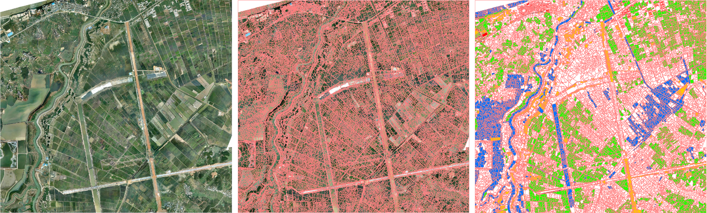
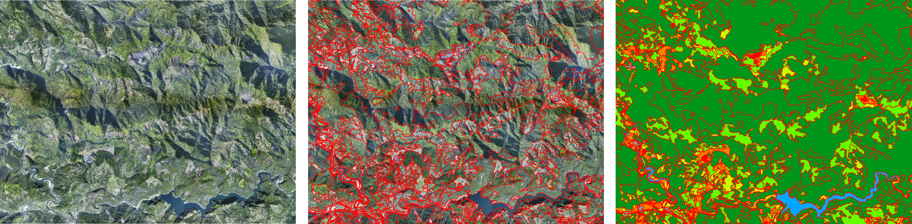

# OBIC-GCN

[English](./README.md) | 简体中文 

本开源项目建立在《基于图卷积神经网络的遥感影像面向对象分类方法[(Object-based Classification Framework of Remote Sensing Images with Graph Convolutional Networks)](https://ieeexplore.ieee.org/document/9411513)》的研究基础上，可为研究人员提供实验源代码、包含遥感影像与多类别面向对象样本标签的数据集。研究成果目前已公开发表在[IEEE Geoscience and Remote Sensing Letters](https://ieeexplore.ieee.org/xpl/RecentIssue.jsp?punumber=8859)期刊上。

## 摘要
基于高分辨率遥感影像的**面向对象分类**（OBIC）有着广泛的应用。目前，许多OBIC方法仅关注各对象自身特征，忽略了相邻对象之间的上下文信息，分类精度较低。受光谱图理论的启发，我们从高分辨率遥感影像生成的对象中构造了图结构，并提出了一种基于截断稀疏奇异值分解与**图卷积网络**模型的OBIC框架，目的在于充分利用对象之间的相对性，提供分类精度。通过在两个经标注的遥感影像数据集上开展实验，我们所提出的OBIC框架在自动和手动对象分割情况下分别获得了97.2%和66.9%的总体精度，训练时间仅占基于卷积神经网络方法时间的1/100。

## OBIC-GCN框架
基于GCN的OBIC框架包括以下基本流程。首先，利用自动或手动分割方法将遥感影像分割为多个对象，提取每个对象的特征生成特征矩阵**F**并经过tSVD降维处理，利用分割对象构建图结构生成邻接矩阵**A**，将矩阵**F**与矩阵**A**输入至OBIC-GCN模型进行训练，利用训练后的模型对输入的对象及其特征进行预测，输出分类结果。

## 数据集
我们在安徽数据集和福建数据集两个遥感图像面向对象分类数据集上进行了内部超参数实验，并与其他OBIC方法进行了外部的对比。
### 安徽数据集

安徽数据集包含了正射遥感影像，基于GBS分割算法的分割对象与五类别标注的部分对象。
### 福建数据集

福建数据集包含了正射遥感影像，人工分割对象与八类别标注对象。
### 数据集下载
研究人员可通过[百度网盘](https://pan.baidu.com/s/1BdwPzNLYh2kg9I-iPwG-ww) (提取码：cveo) 下载**CVEO-OBIC-GCN数据集**，数据集包含以下内容：

- 安徽/福建数据集
    - extracted_features/: 各对象的所提取的特征信息。
    - image/: 包含RGB三波段的正射影像。
    - npz/ : 由对象分割图、对象特征信息与类别标注信息生成的npz文件。
    - segmentation_mask/: 由GBS分割算法与人工分割等方法生成的分割对象图。
    
## 实验
### 不同tSVD降维数对模型精度与训练时间的影响

### GCN模型内部超参数实验

### 与其他OBIC方法的外部对比

## 环境配置
#### 环境需求
    python = 3.7.1
	gdal = 2.3.2
	numpy = 1.19.1
	tensorflow = 1.13.1
	scikit-image = 0.18.2
	scikit-learn = 0.24.2
	pillow = 8.3.1
	scipy = 1.7.1
	xgboost = 1.4.0
#### 利用Conda-forge配置
推荐创建测试所需的conda虚拟环境（Windows 10）。在conda命令行中执行如下命令：
`conda create -n gcn python=3.7 gdal tensorflow=1.13.1 tqdm scikit-image pillow scipy xgboost -c conda-forge
`

## 源代码目录详情
- /data: 包含安徽与福建数据集。
	- ah/: 遥感影像数据、分割掩膜栅格数据、提取的特征数据（.txt与.npz格式）
	- fj/: 与安徽数据集相同
- /docs
- /gcn: 基于TensorFlow框架实现的GCN模型方法，[出自这里](https://github.com/tkipf/gcn)。
- obic.py: 利用不同参数设置训练、验证GCN模型。
- svm.py: 利用不同参数设置训练、验证包含LSVM, RBFSVM, MLP, NaiveBayes, XGBoost, RandomForest等机器学习算法。
- utils.py: 利用分割掩膜图、各对象特征生成可用于训练与验证的.npz文件，并将数据划分为训练、验证与测试集.

## 源代码文件测试命令及参数
###  obic.py (用于测试GCN模型)
| 参数  | 参数信息  |
| ------------ | ------------ |
|  --model | 从'gcn', 'gcn_cheby', 'dense'中选择训练模型。 **默认**: gcn |
| --npz  | 输入npz文件路径。**必填**。 |
| --logfile |  训练日志文件。**必填** |
|  --resfile |  输出测试结果文件。**必填** |
| --learning_rate  | 初始学习率。**默认**: 0.01 |
| --epochs  | 训练迭代次数。 **默认**: 200 |
|  --nodes |  隐藏层节点数。 **默认**: 32 |
|  --layers |  隐藏层层数。 **默认**: 1 |
|  --dropout | Dropout比率。 **默认**: 0.3 |
|  --weight_decay | L2损失的权重。 **默认**: 5e-4 |
|  --early_stopping | 提前停止训练的迭代次数限制。 **默认**: 1000|
| --max_degree | Chebyshev多项式最大阶数。 **默认**: 1 |
| --svd | tSVD降维数（0指不进行降维）。 **默认**: 0  |
|  --seed | 随机种子数。 **默认**: 123 |
#### 测试命令:
`python obic.py --model gcn_cheby --npz data/ah/ah.npz --logfile details_ah_opSVD.log --resfile results_ah_opSVD.log --nodes 64 --layers 3 --dropout 0.3 --max_degree 1 --svd 0`

###  svm.py (用于测试LSVM, RBFSVM, MLP, NaiveBayes, XGBoost, RandomForest等模型)
| 参数  | 参数信息  |
| ------------ | ------------ |
|  --model | 从'lsvm', 'rbfsvm', 'mlp', 'nb', 'xgboost', 'randomforest'中选择训练模型。 **默认**: lsvm |
| --npz  | 输入npz文件路径。 **必填** |
|  --resfile |  输出测试结果文件。 **必填** |
| --pca  | PCA降维数（0指不进行降维）。 **默认**: 0|
| --svd  | tSVD降维数（0指不进行降维）。 **默认**: 0|
|  --seed | 随机种子数。 **默认**: 12|
#### 测试命令:
`python svm.py --model randomforest --npz data/ah/ah.npz --resfile test.log --mode eval --pca 0`

## 快速开始
1. 通过[百度网盘](https://pan.baidu.com/s/1BdwPzNLYh2kg9I-iPwG-ww) (提取码：cveo)下载**CVEO-OBIC-GCN-dataset**数据集，将数据集文件按文件夹存放在目录：**/data**下。
2. 打开anaconda/cmd命令行窗口, 利用`conda activate gcn`命令激活虚拟环境，切换当前运行目录。
3. 通过指定参数并运行代码`python utils.py`，生成用于模型训练与验证的.npz文件。
4. 根据上表设置相应的参数信息，分别运行`python obic.py`或`python svm.py`，开始模型训练与验证。

## 引用本文
如果您在研究中使用了该项目，请引用以下文章。

	@ARTICLE{9411513,
	  author={Zhang, Xiaodong and Tan, Xiaoliang and Chen, Guanzhou and Zhu, Kun and Liao, Puyun and Wang, Tong},
	  journal={IEEE Geoscience and Remote Sensing Letters}, 
	  title={Object-Based Classification Framework of Remote Sensing Images With Graph Convolutional Networks}, 
	  year={2022},
	  volume={19},
	  number={},
	  pages={1-5},
	  doi={10.1109/LGRS.2021.3072627}}
    
## 参考项目
[https://github.com/tkipf/gcn](https://github.com/tkipf/gcn)

[sklearn.decomposition.TruncatedSVD](https://scikit-learn.org/stable/modules/generated/sklearn.decomposition.TruncatedSVD.html)

