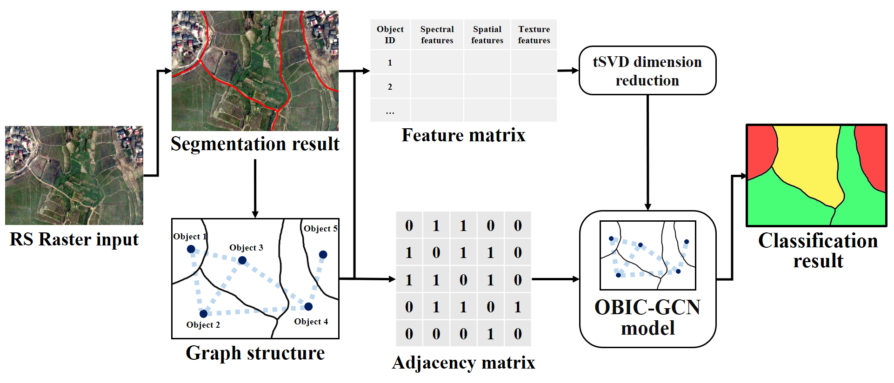
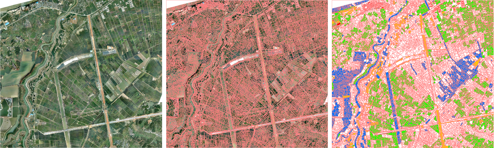
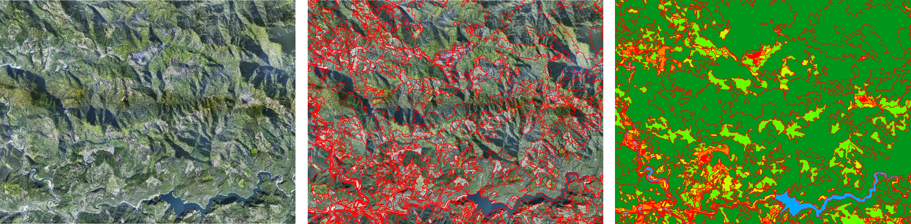
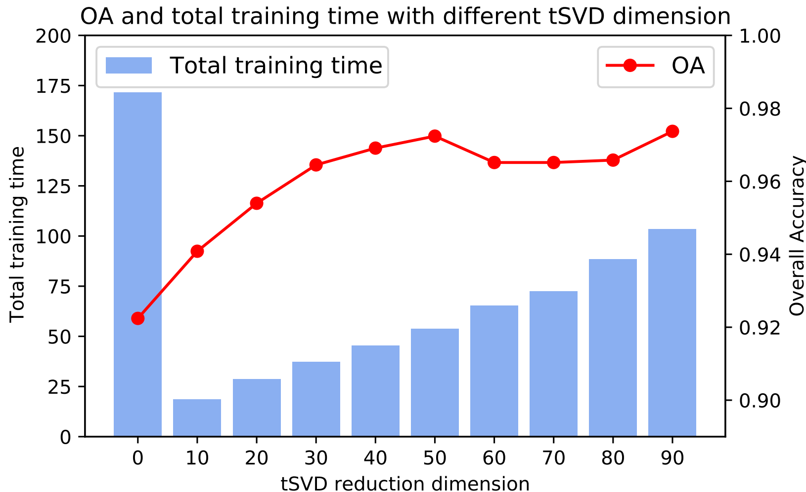
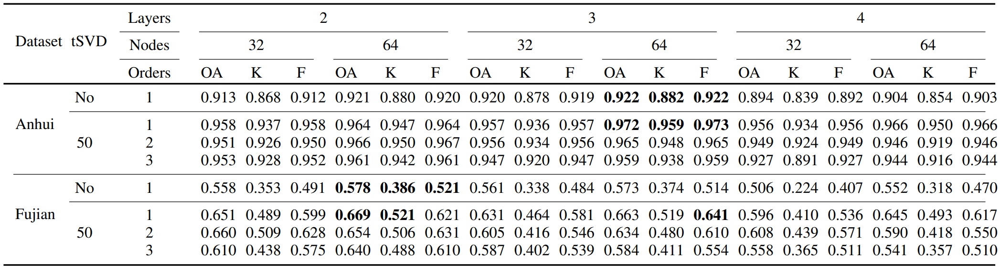
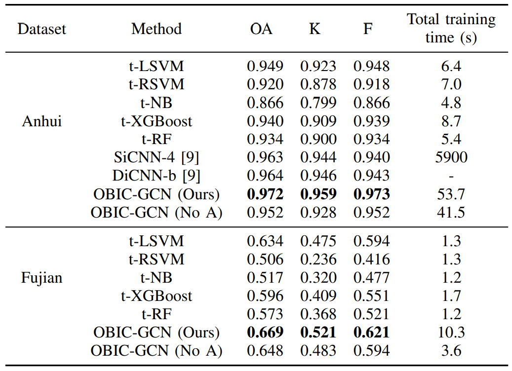

# OBIC-GCN

English | [简体中文](./README-zh_CN.md) 

Open-source codes and annotated datasets in our recent work ["Object-based Classification Framework of Remote Sensing Images with Graph Convolutional Networks"](https://ieeexplore.ieee.org/document/9411513) on [IEEE Geoscience and Remote Sensing Letters](https://ieeexplore.ieee.org/xpl/RecentIssue.jsp?punumber=8859).

## Abstract
Object-based image classification (OBIC) on very-high-resolution remote sensing images is utilized in a wide range of applications. Nowadays, many existing OBIC methods only focus on features of each object itself, neglecting the contextual information among adjacent objects and resulting in low classification accuracy. Inspired by spectral graph theory, we construct a graph structure from objects generated from very-high-resolution remote sensing images, and propose an OBIC framework based on truncated sparse singular value decomposition and graph convolutional network (GCN) model, aiming to make full use of relativities among objects and produce accurate classification. Through conducting experiments on two annotated RS image datasets, our framework obtained 97.2% and 66.9% overall accuracy respectively in automatic and manual object segmentation circumstances, within a processing time of about 1/100 of convolutional neural network (CNN) based methods' training time.

## Proposed OBIC-GCN framework
Firstly, the RS raster is automatically or manually segmented into multiple elements, which are then used for feature extraction and graph structure construction process. The generated feature matrix F is processed by tSVD dimension reduction and utilized as the input of OBIC-GCN model combining with the adjacency matrix A. The trained model makes predictions on the input graph and object features, and finally outputs the classification results.

## Datasets
We conducted internal hyper-parameter tuning and external comparison with other OBIC methods on two VHR RS image datasets named Anhui dataset and Fujian dataset.
### Anhui dataset

Containing DOM, GBS segmentation results and selected labeled objects in Anhui dataset.
### Fujian dataset

Containing DOM, manual segmentation results and labeled objects in Fujian dataset.
### Download dataset
You can download the **CVEO-OBIC-GCN-dataset** at [Baidu Netdisk](https://pan.baidu.com/s/1BdwPzNLYh2kg9I-iPwG-ww) (cveo), which contain the following contents:

- Anhui&Fujian
    - extracted_features/: features extracted from each segmented objects.
    - image/: RGB raster image.
    - npz/ : generated npz file from segmentation map, features and ground truth labels.
    - segmentation_mask/: segmentation mask generated by segmentation algorithm or manual segmentaion.

## Experiments
### Performances of different tSVD reduction dimension

### Model hyper-parameter tuning

### Comparison with other OBIC methods

## Installation
#### Requirement
    python = 3.7.1
	gdal = 2.3.2
	numpy = 1.19.1
	tensorflow = 1.13.1
	scikit-image = 0.18.2
	scikit-learn = 0.24.2
	pillow = 8.3.1
	scipy = 1.7.1
	xgboost = 1.4.0
#### Install with Conda-forge
Creating a new conda environment is recommended (tested on Windows 10). Run this script like:
`conda create -n gcn python=3.7 gdal tensorflow=1.13.1 tqdm scikit-image pillow scipy xgboost -c conda-forge
`

## Contents of Directory
- /data: containing Anhui and Fujian dataset.
	- ah/: Raster image, segmentation vector and mask, extracted features in .txt and .npz format.
	- fj/: Same with Anhui dataset.
- /docs
- /gcn: A TensorFlow implementation of GCN derived from [HERE.](https://github.com/tkipf/gcn "HERE.")
- obic.py: Train and evaluate GCN models with different settings.
- svm.py: Train and evaluate LSVM, RBFSVM, MLP, NaiveBayes, XGBoost, RandomForest models with different settings.
- utils.py: Generate .npz data with segmentation mask, extracted features. And split data into train/val/test sets.

## List of Arguments
###  obic.py (for GCN models)
| Argument  | Details  |
| ------------ | ------------ |
|  --model | Select training model from 'gcn', 'gcn_cheby', 'dense'. **Default**: gcn |
| --npz  | Input npz data. **Required**. |
| --logfile |  Training log file. **Required**. |
|  --resfile |  Output  evaluation result file. **Required**. |
| --learning_rate  | Initial learning rate. **Default**: 0.01. |
| --epochs  | Number of epochs to train.  **Default**: 200. |
|  --nodes |  Number of units in hidden layer. **Default**: 32. |
|  --layers |  Number of hidden layers. **Default**: 1. |
|  --dropout | Dropout rate. **Default**: 0.3 |
|  --weight_decay |  Weight for L2 loss on embedding matrix. **Default**: 5e-4. |
|  --early_stopping |  Tolerance for early stopping (# of epochs). **Default**: 1000.|
| --max_degree | Maximum Chebyshev polynomial degree.  **Default**: 1. |
| --svd  | Reduce dimensions (0 means no svd). **Default**: 0.  |
|  --seed | Random seed.  **Default**: 123. |
#### Run like:
`python obic.py --model gcn_cheby --npz data/ah/ah.npz --logfile details_ah_opSVD.log --resfile results_ah_opSVD.log --nodes 64 --layers 3 --dropout 0.3 --max_degree 1 --svd 0`

###  svm.py (for LSVM, RBFSVM, MLP, NaiveBayes, XGBoost, RandomForest models)
| Argument  | Details  |
| ------------ | ------------ |
|  --model | Select training model from 'lsvm', 'rbfsvm', 'mlp', 'nb', 'xgboost', 'randomforest'. **Default**: lsvm |
| --npz  | Input npz data. **Required**. |
|  --resfile |  Output  evaluation result file. **Required**. |
| --pca  | Reduce dimensions (0 means no pca). **Default**: 0.  |
| --svd  | Reduce dimensions (0 means no svd). **Default**: 0.  |
|  --seed | Random seed.  **Default**: 12. |
#### Run like:
`python svm.py --model randomforest --npz data/ah/ah.npz --resfile test.log --mode eval --pca 0`

## Quick Start
1. Download the **CVEO-OBIC-GCN-dataset** at [Baidu Netdisk](https://pan.baidu.com/s/1BdwPzNLYh2kg9I-iPwG-ww) (cveo). Arrange the above files in **/data/dataset_by_name**.
2. Open anaconda/cmd prompt, **activate** the installed environment by `conda activate gcn`, and change the **working directory** to the current project.
3. Generate .npz files for training and validation by running `python utils.py` after specifying file paths.
4. Run `python obic.py` or `python svm.py` with the above arguments to start training and conduct validation.

## Cite this work
Please consider citing the following article if you used this project in your research.

	@ARTICLE{9411513,
	  author={Zhang, Xiaodong and Tan, Xiaoliang and Chen, Guanzhou and Zhu, Kun and Liao, Puyun and Wang, Tong},
	  journal={IEEE Geoscience and Remote Sensing Letters}, 
	  title={Object-Based Classification Framework of Remote Sensing Images With Graph Convolutional Networks}, 
	  year={2022},
	  volume={19},
	  number={},
	  pages={1-5},
	  doi={10.1109/LGRS.2021.3072627}}
    
## Reference
[https://github.com/tkipf/gcn](https://github.com/tkipf/gcn)

[sklearn.decomposition.TruncatedSVD](https://scikit-learn.org/stable/modules/generated/sklearn.decomposition.TruncatedSVD.html)

## License
Licensed under an MIT license.

